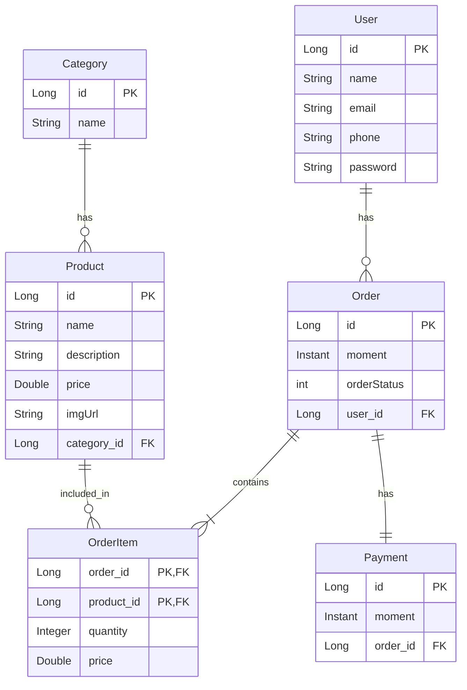

# 🛒 Projeto de E-commerce com Spring Boot

API RESTful para gerenciamento de usuários, produtos, categorias, pedidos e itens de pedido.
Desenvolvida com **Spring Boot**, **JPA/Hibernate** e **MySQL**, seguindo boas práticas de organização, tratamento de exceções e camadas de serviço.

---

## 🚀 Tecnologias Utilizadas


---

## 📦 Dependências Principais

Para utilizar o JPA/Hibernate e os bancos de dados, as seguintes dependências são necessárias no `pom.xml`:

### Spring Data JPA

```xml
<dependency>
    <groupId>org.springframework.boot</groupId>
    <artifactId>spring-boot-starter-data-jpa</artifactId>
</dependency>
```

Fornece todas as funcionalidades do JPA/Hibernate, incluindo:

- Mapeamento objeto-relacional (ORM)
- Gerenciamento de entidades
- Repositórios e consultas
- Transações

### MySQL Connector

```xml
<dependency>
    <groupId>mysql</groupId>
    <artifactId>mysql-connector-java</artifactId>
    <version>8.0.33</version>
</dependency>
```

Driver JDBC para conexão com MySQL:

- Necessário para ambientes `local` e `cpanel`
- Suporte a todas as funcionalidades do MySQL 8+

### MariaDB Driver

```xml
<dependency>
    <groupId>org.mariadb.jdbc</groupId>
    <artifactId>mariadb-java-client</artifactId>
    <version>3.5.5</version>
</dependency>
```

Driver alternativo compatível com MySQL:

- Suporte adicional para MariaDB
- Melhor performance em alguns casos

O H2 Database já está incluído no `spring-boot-starter-test`.

---

## ⚙️ Configurações por Perfil

### Perfil Local (`application-local.properties`)

```properties
# Conexão MySQL Local
spring.datasource.url=jdbc:mysql://localhost:3306/seu_banco
spring.datasource.username=root
spring.datasource.password=sua_senha

# Configurações JPA
spring.jpa.hibernate.ddl-auto=update
spring.jpa.show-sql=true
spring.jpa.open-in-view=true
```

- `ddl-auto=update`: Atualiza o schema automaticamente
- `show-sql=true`: Mostra SQL no console
- Ideal para desenvolvimento

### Perfil de Testes (`application-test.properties`)

```properties
# Banco H2 em memória
spring.datasource.url=jdbc:h2:mem:testdb
spring.h2.console.enabled=true

# Configurações JPA
spring.jpa.database-platform=org.hibernate.dialect.H2Dialect
spring.jpa.defer-datasource-initialization=true
spring.jpa.show-sql=true
spring.jpa.properties.hibernate.format_sql=true
```

- Banco H2 em memória para testes rápidos
- Console web disponível em `/h2-console`
- SQL formatado para melhor leitura

### Perfil cPanel (`application-cpanel.properties`)

```properties
# Conexão MySQL Remota
spring.datasource.url=jdbc:mysql://seu_host:3306/seu_banco
spring.datasource.username=usuario_cpanel
spring.datasource.password=senha_cpanel

# Configurações JPA
spring.jpa.properties.hibernate.dialect=org.hibernate.dialect.MySQLDialect
spring.jpa.hibernate.ddl-auto=update
spring.jpa.show-sql=true
spring.jpa.open-in-view=true
```

- Configurado para MySQL em produção
- Dialect específico para MySQL
- Logs SQL habilitados para monitoramento

### Configurações Globais (`application.properties`)

```properties
# Configurações JPA comuns
spring.jpa.open-in-view=true
spring.jpa.show-sql=true
```

Aplicadas a todos os perfis, podem ser sobrescritas.

---

## � Dependências Principais

Para utilizar o JPA/Hibernate e os bancos de dados, as seguintes dependências são necessárias no `pom.xml`:

### Spring Data JPA

```xml
<dependency>
    <groupId>org.springframework.boot</groupId>
    <artifactId>spring-boot-starter-data-jpa</artifactId>
</dependency>
```

Fornece todas as funcionalidades do JPA/Hibernate, incluindo:

- Mapeamento objeto-relacional (ORM)
- Gerenciamento de entidades
- Repositórios e consultas
- Transações

### MySQL Connector

```xml
<dependency>
    <groupId>mysql</groupId>
    <artifactId>mysql-connector-java</artifactId>
    <version>8.0.33</version>
</dependency>
```

Driver JDBC para conexão com MySQL:

- Necessário para ambientes `local` e `cpanel`
- Suporte a todas as funcionalidades do MySQL 8+

### MariaDB Driver

```xml
<dependency>
    <groupId>org.mariadb.jdbc</groupId>
    <artifactId>mariadb-java-client</artifactId>
    <version>3.5.5</version>
</dependency>
```

Driver alternativo compatível com MySQL:

- Suporte adicional para MariaDB
- Melhor performance em alguns casos

O H2 Database já está incluído no `spring-boot-starter-test`.

---

## ⚙️ Configurações por Perfil

### Perfil Local (`application-local.properties`)

```properties
# Conexão MySQL Local
spring.datasource.url=jdbc:mysql://localhost:3306/seu_banco
spring.datasource.username=root
spring.datasource.password=sua_senha

# Configurações JPA
spring.jpa.hibernate.ddl-auto=update
spring.jpa.show-sql=true
spring.jpa.open-in-view=true
```

- `ddl-auto=update`: Atualiza o schema automaticamente
- `show-sql=true`: Mostra SQL no console
- Ideal para desenvolvimento

### Perfil de Testes (`application-test.properties`)

```properties
# Banco H2 em memória
spring.datasource.url=jdbc:h2:mem:testdb
spring.h2.console.enabled=true

# Configurações JPA
spring.jpa.database-platform=org.hibernate.dialect.H2Dialect
spring.jpa.defer-datasource-initialization=true
spring.jpa.show-sql=true
spring.jpa.properties.hibernate.format_sql=true
```

- Banco H2 em memória para testes rápidos
- Console web disponível em `/h2-console`
- SQL formatado para melhor leitura

### Perfil cPanel (`application-cpanel.properties`)

```properties
# Conexão MySQL Remota
spring.datasource.url=jdbc:mysql://seu_host:3306/seu_banco
spring.datasource.username=usuario_cpanel
spring.datasource.password=senha_cpanel

# Configurações JPA
spring.jpa.properties.hibernate.dialect=org.hibernate.dialect.MySQLDialect
spring.jpa.hibernate.ddl-auto=update
spring.jpa.show-sql=true
spring.jpa.open-in-view=true
```

- Configurado para MySQL em produção
- Dialect específico para MySQL
- Logs SQL habilitados para monitoramento

### Configurações Globais (`application.properties`)

```properties
# Configurações JPA comuns
spring.jpa.open-in-view=true
spring.jpa.show-sql=true
```

Aplicadas a todos os perfis, podem ser sobrescritas.

---

## �📂 Estrutura do Projeto

```
src/main/java/com/jotaempresas/curso/
├── config/              # Configurações e inicialização de dados
├── entity/              # Entidades JPA (modelo de domínio)
│   ├── enums/           # Enums
│   ├── exception/       # Exceções personalizadas
│   └── pk/              # Chaves compostas
├── repositories/        # Repositórios Spring Data JPA
├── resources/           # Controladores REST (API)
└── service/             # Camada de serviços (regras de negócio)
```

---

## 📊 Modelo de Domínio (Mermaid)



---

## ⚙️ Funcionalidades da API

✅ CRUD completo para **Usuários, Categorias, Produtos, Pedidos e Itens de Pedido**
✅ **Validações e regras de negócio** na camada de serviço
✅ **Tratamento centralizado de exceções** (`@RestControllerAdvice`)
✅ **Perfis configuráveis** (`local`, `test`, `cpanel`)
✅ **Banco H2** para desenvolvimento/testes rápidos

---

## 🔗 Endpoints Principais

### 👤 Usuários (`/users`)

* `GET /users` → Lista todos
* `GET /users/{id}` → Busca por ID
* `GET /users/email/{email}` → Busca por email
* `POST /users/insert` → Cadastra usuário
* `PUT /users/updateUser/{id}` → Atualiza dados
* `DELETE /users/deletar/{id}` → Remove usuário

### 📦 Produtos (`/products`)

* `GET /products` → Lista todos
* `GET /products/{id}` → Busca por ID
* `DELETE /products/deletar/{id}` → Remove produto

### 🏷️ Categorias (`/categorys`)

* `GET /categorys` → Lista todas
* `GET /categorys/{id}` → Busca por ID
* `DELETE /categorys/deletar/{id}` → Remove categoria

### 🧾 Pedidos (`/orders`)

* `GET /orders` → Lista todos
* `GET /orders/{id}` → Busca por ID
* `DELETE /orders/deletar/{id}` → Remove pedido

### 📑 Itens de Pedido (`/orderItem`)

* `GET /orderItem` → Lista todos
* `GET /orderItem/{id}` → Busca por ID
* `DELETE /orderItem/deletar/{id}` → Remove item

---

## 🛠️ Tratamento de Exceções

| Exceção                       | Status HTTP | Descrição                                 |
| ----------------------------- | ----------- | ----------------------------------------- |
| `ResourceBadRequestException` | `400`       | Requisição inválida (campos obrigatórios) |
| `ResourceConflictException`   | `409`       | Conflito de dados (e.g., email duplicado) |
| `ResourceNotFoundException`   | `404`       | Recurso não encontrado                    |

📌 Todas as respostas de erro seguem o padrão definido em `ExecptionErrorClasse`.

---

## ⚡ Perfis de Configuração

* **`local`** → Conexão com MySQL local
* **`test`** → Banco **H2 em memória** (com console `/h2-console`)
* **`cpanel`** → Banco remoto MySQL (produção/cPanel)

---

## ▶️ Como Executar o Projeto

### Pré-requisitos

* **JDK 17+**
* **Maven**
* Banco de dados configurado (MySQL ou H2)

### Passos

```bash
# Compilar o projeto
mvn clean install

# Executar com perfil local (MySQL)
mvn spring-boot:run -Dspring-boot.run.profiles=local

# Executar com perfil de teste (H2)
mvn spring-boot:run -Dspring-boot.run.profiles=test

# Executar com perfil de produção (cPanel)
mvn spring-boot:run -Dspring-boot.run.profiles=cpanel
```

A aplicação estará disponível em:
👉 `http://localhost:8080`

---

## ✨ Autor

Desenvolvido por **Jota Empresas**
📧 [Entre em contato](mailto:seuemail@exemplo.com)

---
